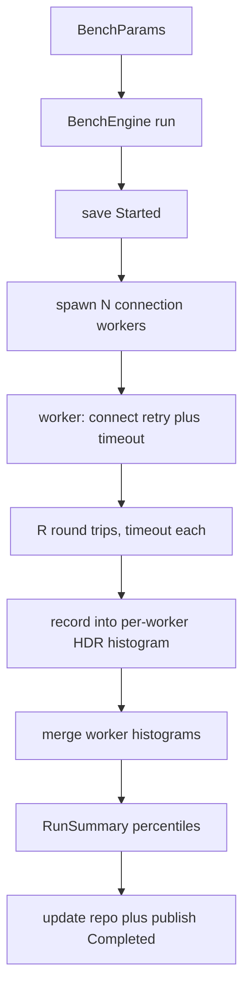
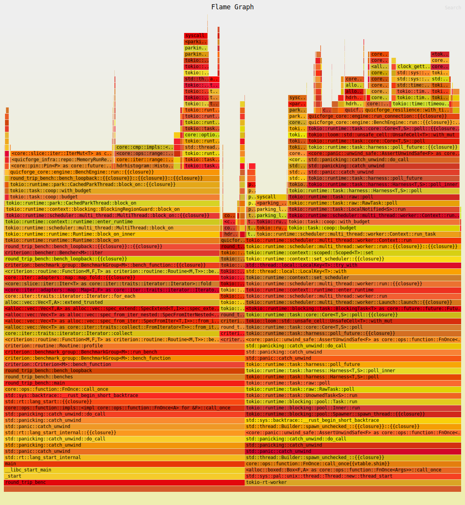

# QuicForge

**A QUIC / kernel round-trip latency lab in Rust.**

QuicForge measures TPU-style QUIC round-trip latency the way a Solana validator's
transaction-processing-unit ingress does: many concurrent QUIC connections, small
datagram-sized payloads, and a tail-latency-first view of the results. It records
every round-trip into an **HDR histogram**, tunes the UDP socket buffers, and exposes
the whole harness through both a **GraphQL API** (with live subscriptions) and a
**CLI**.

It is built as a production-grade, hexagonal Cargo workspace: a pure domain core,
swappable transport adapters (an in-process loopback simulator and a real `quinn`
QUIC stack), resilience primitives, full observability, and a comprehensive test
suite.

[](https://github.com/ABHIJEET-MUNESHWAR/QuicForge/actions/workflows/ci.yml)
[](https://www.rust-lang.org)
[](https://doc.rust-lang.org/edition-guide/)
[](Cargo.toml)

[](.github/workflows/ci.yml)
[](.github/workflows/ci.yml)
[](.github/workflows/ci.yml)
[](https://github.com/rust-secure-code/safety-dance)

[](https://tokio.rs)
[](https://async-graphql.github.io)
[](Dockerfile)
[](#)

[](https://github.com/ABHIJEET-MUNESHWAR/QuicForge/commits)
[](https://github.com/ABHIJEET-MUNESHWAR/QuicForge/issues)
[](https://github.com/ABHIJEET-MUNESHWAR/QuicForge/stargazers)

---

## Table of Contents

- [Why this exists](#why-this-exists)
- [Architecture](#architecture)
  - [Component details](#component-details)
  - [Architecture flows](#architecture-flows)
- [The measurement model](#the-measurement-model)
- [Quick start](#quick-start)
  - [Prerequisites](#prerequisites)
  - [Build & test](#build--test)
  - [CLI benchmark](#cli-benchmark)
  - [GraphQL server](#graphql-server)
- [GraphQL API](#graphql-api)
- [Operational endpoints](#operational-endpoints)
  - [Metrics](#metrics)
- [Profiling & flame graph](#profiling--flame-graph)
- [Configuration](#configuration)
- [Docker](#docker)
- [Project layout](#project-layout)
- [Testing & quality gates](#testing--quality-gates)
  - [Test results](#test-results)
- [License](#license)

---

## Why this exists

Landing transactions on Solana is a latency game played over QUIC against the leader's
TPU. Before you can optimize that path you have to *measure* it precisely — including
the p99/p99.9 tail, which is where real money is lost. QuicForge is a focused lab for
exactly that: a reusable, well-instrumented QUIC round-trip benchmarker with the
ergonomics (GraphQL, metrics, HDR percentiles, socket tuning) you'd want in a real
low-latency networking team.

---

## Architecture

Hexagonal / ports-and-adapters. Dependencies point **inward**; the domain core knows
nothing about QUIC, axum, or GraphQL.

```
            ┌─────────────────────────────────────────────┐
            │                quicforge-node                │  composition root
            │   CLI (clap) · axum HTTP/WS · telemetry      │  + binary
            └───────────────┬───────────────┬─────────────┘
                            │               │
                   ┌────────▼──────┐  ┌──────▼────────────┐
                   │ quicforge-api │  │  quicforge-infra  │  adapters
                   │ async-graphql │  │ quinn · loopback  │
                   │ schema/types  │  │ memory repo · bus │
                   └────────┬──────┘  └──────┬────────────┘
                            │   implements   │ implements
                            │     ports      │   ports
                       ┌────▼────────────────▼────┐
                       │      quicforge-core       │  domain
                       │  BenchEngine · ports ·    │  (no I/O frameworks)
                       │  HDR aggregation · events │
                       └────────────┬──────────────┘
                                    │
                  ┌─────────────────┼─────────────────┐
          ┌───────▼────────┐               ┌───────────▼─────────┐
          │ quicforge-types │               │ quicforge-resilience│
          │ newtypes·stats  │               │ timeout · retry     │
          └─────────────────┘               └─────────────────────┘
```

| Crate | Responsibility | Depends on |
|---|---|---|
| **quicforge-types** | Domain newtypes (`PayloadSize`, `ConnectionCount`, `RequestCount`), `BenchParams`, latency `stats`, run lifecycle (`RunId`, `RunStatus`, `RunSummary`). Pure data, compile-time-validated invariants. | — |
| **quicforge-resilience** | `with_timeout`, `RetryPolicy` with exponential backoff + equal jitter. Deliberately **no** circuit breaker / rate limiter (they'd distort latency measurement). | — |
| **quicforge-core** | The `BenchEngine` orchestrator + ports (`QuicConnector`, `QuicConnection`, `RunRepository`, `EventSink`, `RunEventStream`, `Clock`), HDR histogram aggregation, domain events. No I/O frameworks. | types, resilience |
| **quicforge-infra** | Adapters: `QuinnConnector` + `QuicEchoServer` (real QUIC, `quic` feature), `LoopbackConnector` (simulator), `MemoryRunRepository`, `BroadcastEventSink`, `SystemClock`. | types, core |
| **quicforge-api** | `async-graphql` schema: queries (`run`, `runs`, `apiVersion`), mutation (`startBenchmark`), subscription (`runProgress`), and GraphQL object/input types. | types, core |
| **quicforge-node** | Composition root: clap CLI (`serve` / `bench`), axum HTTP + WS wiring, telemetry, graceful shutdown, the `quicforge-node` binary, and a criterion bench. | all of the above |

**Why no `ai` crate?** QuicForge is a pure-networking/latency tool — adding an LLM layer
would be scope creep. (Its sibling project SolLander demonstrates the AI-advisor layer.)

### Component details

Every component maps to a box in the diagram. Dependencies point inward
(`node → api / infra / core → types`, with `resilience` a leaf utility); each crate carries
`#![forbid(unsafe_code)]`.

#### `quicforge-types` — domain vocabulary (zero I/O)

| Module | Key items | Responsibility |
|---|---|---|
| `params.rs` | `BenchParams`, `PayloadSize`, `ConnectionCount`, `RequestCount` | Validated newtypes — an out-of-range benchmark config cannot be constructed. |
| `run.rs` | `RunId`, `RunStatus`, `RunSummary` | The run lifecycle and its final percentile/throughput summary. |
| `stats.rs` | latency stat types | The percentile snapshot (min/mean/p50/p90/p99/p99.9/max) the histogram reduces to. |
| `error.rs` | validation errors | Typed boundary errors with stable codes. |

#### `quicforge-resilience` — latency-safe guards (leaf)

| Module | Key items | Responsibility |
|---|---|---|
| `lib.rs` | `with_timeout`, `RetryPolicy` | Deadline wrapper + exponential-backoff-with-jitter retry. **Deliberately no breaker/limiter** — they would distort the latencies under measurement. |

#### `quicforge-core` — engine + ports (inside the hexagon)

| Module | Key items | Responsibility |
|---|---|---|
| `ports.rs` | `QuicConnector`, `QuicConnection`, `RunRepository`, `EventSink`, `RunEventStream`, `Clock` | The hexagonal ports the engine depends on — the transport seam is `QuicConnector`. |
| `engine.rs` | `BenchEngine`, `BenchDeps` | The **hot path**: spawns one worker task per connection, drives round-trips, folds results into a `RunSummary`. |
| `histo.rs` | HDR aggregation | Per-worker `hdrhistogram` recording + lossless merge for exact percentiles. |
| `config.rs` | `EngineConfig` | Timeouts and engine tunables. |
| `events.rs` | `RunEvent` | `Started` / `Progress` / `Completed` / `Failed` fan-out events. |
| `error.rs` | `PortError`, `CoreError` | Adapter-fault vs domain-outcome separation. |

#### `quicforge-infra` — adapters (outside the hexagon)

| Module | Key items | Responsibility |
|---|---|---|
| `quic.rs` | `QuinnConnector`, `QuicEchoServer` | Real QUIC transport via `quinn` (`quic` feature) + a self-spawnable echo server. |
| `sim.rs` | `LoopbackConnector`, `LoopbackConnection` | In-process deterministic transport (default) — measures orchestration with no socket noise. |
| `repo.rs` | `MemoryRunRepository` | In-memory `RunRepository` read model. |
| `events.rs` | `BroadcastEventSink` | `tokio::broadcast` bus implementing `EventSink` + the subscription stream. |
| `clock.rs` | `SystemClock` | Wall-clock adapter. |

#### `quicforge-api` — GraphQL surface

| Module | Key items | Responsibility |
|---|---|---|
| `schema.rs` | schema builder | Assembles the schema + DoS limits. |
| `query.rs` | `QueryRoot` | `apiVersion`, `run`, `runs`. |
| `mutation.rs` | `MutationRoot` | `startBenchmark` — runs a benchmark and returns its `RunSummary`. |
| `subscription.rs` | `SubscriptionRoot` | `runProgress` over WebSocket. |
| `types.rs` | GraphQL objects/inputs | Anti-corruption layer between domain types and the wire. |

#### `quicforge-node` — composition root (binary)

| Module | Key items | Responsibility |
|---|---|---|
| `main.rs` | CLI entry | `serve` / `bench` via `clap`. |
| `config.rs` | node config | CLI/env → `EngineConfig` + transport selection. |
| `startup.rs` | axum wiring | HTTP + WS routes, `/metrics`, graceful shutdown. |
| `telemetry.rs` | observability | `tracing` (text/JSON) + Prometheus recorder. |
| `bench.rs` | `bench` job | The CLI benchmark command and its report. |

### Architecture flows

**1 · Benchmark run flow** (`mutation startBenchmark` / CLI `bench`)



`BenchEngine::run` persists the run as `Started`, then spawns **one Tokio task per connection**.
Each worker connects through a `RetryPolicy`- and `with_timeout`-guarded `QuicConnector`, issues
`requests_per_connection` round-trips (each timeout-bounded and timed), and records every sample
into a per-worker HDR histogram. The histograms merge losslessly into an exact-percentile
`RunSummary`, which is written back and published as `Completed`.

**2 · Per-connection worker flow** — `QuicConnector::connect` (retry + timeout) → loop
`round_trip` (timeout each, `Instant`-timed) → record into HDR → `close`. A transport failure
folds into `RunStatus::Failed { reason }` rather than collapsing the whole run.

**3 · Subscription / progress flow** — `runProgress` subscribes to the `BroadcastEventSink`;
`Started` / `Progress` / `Completed` / `Failed` events stream to all WebSocket subscribers.

**4 · Read-model query flow** — `run(id)` and `runs(limit)` read from `MemoryRunRepository`.

**5 · Transport-selection flow** — the same engine runs over either the `LoopbackConnector`
(default, deterministic) or the real `QuinnConnector` + optional self-spawned `QuicEchoServer`
(`quic` feature). The core never changes — only which adapter is wired behind `QuicConnector`.

**6 · Bootstrap / serve flow** — `main` → `telemetry::init` → build `BenchEngine` + schema →
`startup` mounts HTTP + WS routes → serve until SIGINT/SIGTERM triggers graceful shutdown.

---

## The measurement model

- Each benchmark spawns **one worker task per connection** (`tokio::spawn`), so N
  connections run truly concurrently.
- A worker establishes its QUIC connection through a `RetryPolicy`-guarded,
  timeout-bounded connect, then issues `requests_per_connection` round-trips back to
  back, timing each with `Instant::now()`.
- Every round-trip is recorded into a per-worker **HDR histogram**
  (`hdrhistogram`, 3 significant figures, 1 ns … 1 h range). Workers' histograms are
  merged losslessly at the end, so percentiles are exact across all samples.
- A transport failure folds into the `RunSummary` as `RunStatus::Failed { reason }`
  rather than collapsing the whole call — `Err` is reserved for repository faults.

Reported percentiles: **min, mean, p50, p90, p99, p99.9, max** plus throughput
(req/s and Mbit/s).

---

## Quick start

### Prerequisites
- Rust **1.89.0** (pinned via `rust-toolchain.toml`).

### Build & test

```bash
cargo build --workspace
cargo test  --workspace                  # loopback adapters
cargo test  --workspace --all-features   # also exercises the real QUIC stack
```

### CLI benchmark

Loopback (no network — deterministic, always available):

```bash
cargo run -p quicforge-node -- bench \
  --transport loopback --connections 4 --requests 2000 --payload 1232 --sim-delay-us 5
```

Real QUIC against a self-spawned local echo server:

```bash
cargo run -p quicforge-node --features quic -- bench \
  --transport quic --spawn-echo --connections 4 --requests 500 --payload 1232
```

Sample output:

```
QuicForge benchmark — Quic transport
  target: 127.0.0.1:39835
  4 connections x 500 requests (2000 total), 1232-byte payload

latency (microseconds):
  samples :         2000
  min     :      188.672
  mean    :      414.693
  p50     :      395.775
  p90     :      551.423
  p99     :      766.975
  p99.9   :     1687.551
  max     :     2473.983

throughput:
        9248.3 req/s
        91.151 Mbit/s
```

### GraphQL server

```bash
cargo run -p quicforge-node -- serve --host 127.0.0.1 --port 8080
# open http://127.0.0.1:8080/graphql for the GraphiQL playground
```

Run a benchmark over the API:

```bash
curl -s -X POST http://127.0.0.1:8080/graphql \
  -H 'content-type: application/json' \
  -d '{"query":"mutation{ startBenchmark(input:{target:\"127.0.0.1:0\", connections:2, requestsPerConnection:1000, payloadBytes:1232}){ state totalRequests stats{ samples p50Micros p99Micros } throughput{ requestsPerSec megabitsPerSec } } }"}'
```

---

## GraphQL API

| Kind | Field | Description |
|---|---|---|
| Query | `apiVersion` | Crate version string. |
| Query | `run(id)` | Fetch a single run by UUID. |
| Query | `runs(limit)` | Most recent runs (limit clamped to 1..200). |
| Mutation | `startBenchmark(input)` | Run a benchmark and return its `RunSummary`. |
| Subscription | `runProgress` | Live `Started` / `Progress` / `Completed` / `Failed` events over WebSocket (`/graphql/ws`). |

A Postman collection is provided in [`postman/QuicForge.postman_collection.json`](postman/QuicForge.postman_collection.json).

---

## Operational endpoints

| Endpoint | Purpose |
|---|---|
| `GET /health/live` | Liveness probe. |
| `GET /health/ready` | Readiness probe. |
| `GET /metrics` | Prometheus exposition. |
| `GET/POST /graphql` | GraphiQL UI (GET) + GraphQL queries (POST). |
| `WS /graphql/ws` | GraphQL subscriptions. |

### Metrics

`quicforge_runs_total`, `quicforge_runs_completed_total`, `quicforge_runs_failed_total`,
`quicforge_requests_total`, `quicforge_round_trip_seconds` (histogram), and
`quicforge_graphql_requests_total`.

```bash
docker compose --profile monitoring up   # node + Prometheus on :9090
```

---

## Profiling & flame graph

The engine hot path is profiled in-process with the [`pprof`](https://github.com/tikv/pprof-rs)
sampling profiler wired into the criterion bench — **no `perf`, root, or kernel tuning required**
(it works inside WSL2/containers where `perf` usually does not). A `SIGPROF` timer samples the
call stack at 1 kHz and [`inferno`](https://github.com/jonhoo/inferno) renders the SVG. The
bench runs over the `LoopbackConnector`, so the picture isolates orchestration + HDR-aggregation
overhead from socket/QUIC noise.

[](docs/flamegraph.svg)

> The inline image is a snapshot — open [`docs/flamegraph.svg`](docs/flamegraph.svg) directly for
> the interactive, zoomable version.

Regenerate it any time:

```bash
cargo bench -p quicforge-node --bench round_trip_bench -- --profile-time 10 'loopback_4x256_round_trips'
cp target/criterion/loopback_4x256_round_trips/profile/flamegraph.svg docs/flamegraph.svg
```

**Reading the graph** (4 connections x 256 loopback round-trips; width = share of on-CPU
samples). The stack under `BenchEngine::run` matches the measurement model:

- **`tokio::spawn` task frames** — the one-worker-task-per-connection model (visible as task
  `Cell` create/drop frames).
- **`LoopbackConnection::round_trip` + `with_timeout`** — the timeout-bounded per-request path.
- **`hdrhistogram::HistogramIterator` / `PickyIterator::pick`** — percentile merge + iteration at
  summary time (the cost of exact tail latencies).
- **`RunRepository::save` / `update` + `EventSink::publish`** — run-lifecycle writes and events.
- **`Clock::now`** — the per-round-trip timestamps.

With the network factored out, the visible cost is the **round-trip orchestration, the timeout
wrapper, and the HDR percentile machinery** — exactly the overhead a latency lab needs to keep
small so it does not pollute its own measurements.

---

## Configuration

All flags have environment-variable equivalents (clap `env`):

| Variable | Flag | Default |
|---|---|---|
| `QUICFORGE_HOST` | `--host` | `127.0.0.1` |
| `QUICFORGE_PORT` | `--port` | `8080` |
| `QUICFORGE_TRANSPORT` | `--transport` | `loopback` |
| `QUICFORGE_LOG_JSON` | `--log-json` | `false` |
| `RUST_LOG` | — | `info` |

---

## Docker

```bash
docker build -t quicforge .
docker run --rm -p 8080:8080 quicforge                  # serve (default)
docker run --rm quicforge bench --transport quic --spawn-echo --requests 500
```

The image is multi-stage (`rust:1.89-slim` → `debian:bookworm-slim`), built with the
`quic` feature, and runs as a non-root user (`uid 10001`).

---

## Project layout

```
QuicForge/
├── crates/
│   ├── quicforge-types/        # domain newtypes, stats, run lifecycle
│   ├── quicforge-resilience/   # timeout + retry/backoff
│   ├── quicforge-core/         # BenchEngine, ports, HDR aggregation, events
│   ├── quicforge-infra/        # quinn + loopback adapters, memory repo, event bus
│   ├── quicforge-api/          # async-graphql schema/types
│   └── quicforge-node/         # CLI + axum server + binary + criterion bench
├── monitoring/prometheus.yml
├── postman/QuicForge.postman_collection.json
├── Dockerfile · docker-compose.yml
└── .github/workflows/ci.yml
```

---

## Testing & quality gates

```bash
cargo fmt --all -- --check
cargo clippy --workspace --all-targets --all-features -- -D warnings
cargo test  --workspace --all-features
cargo bench -p quicforge-node            # criterion: loopback_4x256_round_trips
```

- **32 tests** across the workspace (unit + adapter integration + a live QUIC
  echo round-trip), all green; `clippy` clean under both feature sets.
- `#![forbid(unsafe_code)]` in every crate.
- The `quic` integration tests stand up a real `quinn` endpoint on `127.0.0.1:0` and
  benchmark against it end-to-end.

### Test results

Latest `cargo test --workspace --all-features` run (Rust 1.89.0) — **32 passed, 0 failed, 0 ignored**:

| Suite | Tests | Result |
|---|---:|:--|
| `quicforge-infra` (unit) | 9 | ok |
| `quicforge-resilience` (unit) | 6 | ok |
| `quicforge-core` (unit) | 5 | ok |
| `quicforge-types` (unit) | 5 | ok |
| `quicforge-node` (unit) | 4 | ok |
| `quicforge-api` (unit) | 3 | ok |
| Doc-tests (6 crates) | 0 | ok |
| **Total** | **32** | **ok** |

<details>
<summary>Raw <code>cargo test</code> summary</summary>

```text
   Running unittests src/lib.rs (quicforge_infra)
test result: ok. 9 passed; 0 failed; 0 ignored; 0 measured; 0 filtered out
   Running unittests src/lib.rs (quicforge_resilience)
test result: ok. 6 passed; 0 failed; 0 ignored; 0 measured; 0 filtered out
   Running unittests src/lib.rs (quicforge_core)
test result: ok. 5 passed; 0 failed; 0 ignored; 0 measured; 0 filtered out
   Running unittests src/lib.rs (quicforge_types)
test result: ok. 5 passed; 0 failed; 0 ignored; 0 measured; 0 filtered out
   Running unittests src/lib.rs (quicforge_node)
test result: ok. 4 passed; 0 failed; 0 ignored; 0 measured; 0 filtered out
   Running unittests src/lib.rs (quicforge_api)
test result: ok. 3 passed; 0 failed; 0 ignored; 0 measured; 0 filtered out
```
</details>

See [`EVALUATION.md`](EVALUATION.md) for how the codebase maps to each engineering
guideline.

---

## License

Apache-2.0 © Abhijeet Ashok Muneshwar
